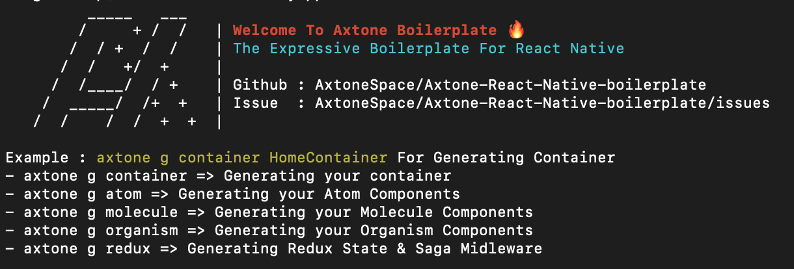

<p align="center">
  <a href="#">
    
  </a>
</p>
<h1 align="center">
  Axtone The Expressive React Native Boilerplate.
</h1>

<h4 align="center">
  <a href="#">Documentation</a>
</h4>
<p align="center">
An open source composable generator engine built for developers.
</p>
<p align="center">
  <a href="https://github.com/AxtoneSpace/Axtone-React-Native-boilerplate/blob/master/LICENSE">
    
  </a>
  <a href="https://github.com/AxtoneSpace/Axtone-React-Native-boilerplate/blob/master/package.json">
    
  </a>
  <a href="#">
    
  </a>
</p>

The boilerplate provides **an optimized architecture for building solid cross-platform mobile applications** through separation of concerns between the UI and business logic. It is fully documented so that each piece of code that lands in your application can be understood and used.

## Requirements

Node 12 or greater is required. Development for iOS requires a Mac and Xcode 10 or up, and will target iOS 11 and up.

You also need to install the dependencies required by React Native.  
Go to the [React Native environment setup](https://reactnative.dev/docs/environment-setup), then select `React Native CLI Quickstart` tab.  
Follow instructions for your given `development OS` and `target OS`.

## Getting Started

To install this pacage run :

1. **Install Axtone CLI**

    ```bash
    npm install -g axtone
    ```

2. **Make sure axtone is installed**

    ```bash
    axtone -v
    ```
    If it is installed, a page like this will appear
    
3. **Create a new React Native project**

    ```bash
    axtone create-project PizzaApp
    ```

4. **Start your React Native Aplication**

    ```bash
    cd PizzaApp
    npx react-native run android
    ```
    if you're using ios, you can run
    ```bash
    npx react-native run ios
    ```
    if your installation is successful then you will see a welcome page like this.

    


## Tech Stack

- **React Native** version 0.69.3*
- **React Navigation** version 6.0.13*
- **React Redux** version 8.0.4*
- **Redux version** 4.2.0*
- **Redux Saga** version 1.2.1*
- **Redux Persist** version 6.0.0*
- **I18Next** version 11.18.6*


## License

Licensed under the [MIT License](https://github.com/AxtoneSpace/Axtone-React-Native-boilerplate/blob/master/LICENSE)
